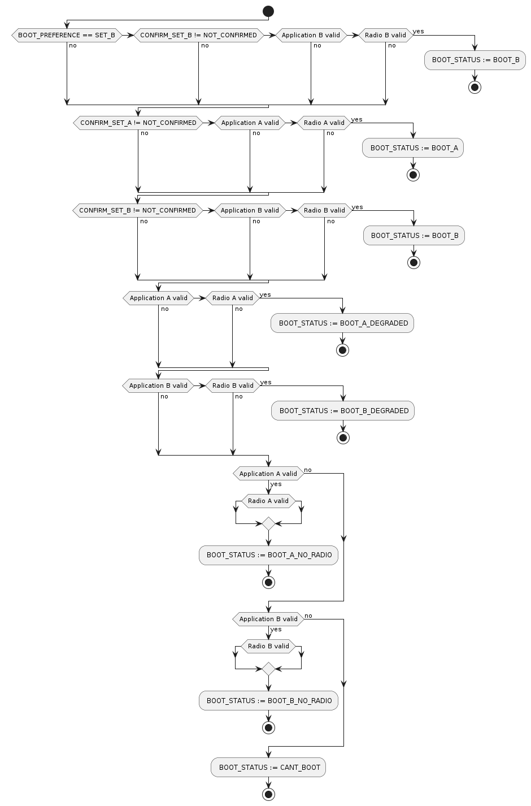

.. _nrf54h_suit_ab_sample:

SUIT: Device firmware A/B update on the nRF54H20 SoC
####################################################

.. contents::
   :local:
   :depth: 2

The sample demonstrates how to configure the application, so it will be updated using the "A/B" method using :ref:`SUIT <ug_nrf54h20_suit_intro>` as well as the usage of manifest-controlled variables for implementing a mechanism to confirm device operation after the update.

The sample is capable of being updated using SMP protocol with both transports: UART or Bluetooth® Low Energy.

Requirements
************

The sample supports the following development kit:

.. table-from-rows:: /includes/sample_board_rows.txt
   :header: heading
   :rows: nrf54h20dk_nrf54h20_cpuapp

You need the nRF Device Manager app for SUIT update over Bluetooth Low Energy:

* `nRF Device Manager mobile app for Android`_
  (The minimum required version is v2.2.1.)

* `nRF Device Manager mobile app for iOS`_
  (The minimum required version is v1.8.0.)

To perform a SUIT update over UART using the SMP protocol, install SUIT commands in nrfutil by running the ``nrfutil install suit`` command (requires nrfutil version 0.8.1 or higher).

Overview
********

The main puprose of this sample is to provide a good starting point for applications that would like to use the "A/B" update method.
Apart from all configuration parameters, template files and sources, it also introduces a new file structure, that will simplify the development:

* Only a single variant of the application configuration is available.
* A dedicated file to define the memory map (``sysbuild/nrf54h20dk_nrf54h20_memory_map.dtsi``).
* A dedicated file to set manifest provisioning configuration (``suit_mpi.conf``).
* A sample logic for managing manifest variables (``src/device_management.c``).
* A sample logic for checking the state of manifests (``src/suit_manifest_state.c``).
* A sample logic for checking the state of in-place updateable components (``src/suit_components_state.c``).

The "A/B" method is based on the assumption that the system is partitioned in such a way that each executable part of the firmware has two memory regions assigned (often referred as ``A`` and ``B`` slots or variants).
Each of the firmware variants has to be executable from their own memory region, thus every part of the application is going to be (at least) linked twice, once for each slot.

The sample uses several manifest-controlled variables:

* ``BOOT_STATUS``: This variable is used to pass information from SDFW to the application about the selected boot path inside the root manifest.

  * The value of ``1`` (``BOOT_A``) indicates the successful boot of the variant ``A``.
  * The value of ``2`` (``BOOT_B``) indicates the successful boot of the variant ``B``.
  * The value of ``3`` (``BOOT_A_DEGRADED``) indicates the degraded boot of the variant ``A``.
  * The value of ``4`` (``BOOT_B_DEGRADED``) indicates the degraded boot of the variant ``B``.
  * The value of ``5`` (``BOOT_A_NO_RADIO``) indicates the emergency boot of the application variant ``A`` without the radio firmware.
  * The value of ``6`` (``BOOT_B_NO_RADIO``) indicates the emergency boot of the application variant ``B`` without the radio firmware.
  * The value of ``7`` (``BOOT_CANT_BOOT``) indicates the root manifest was unable to boot the device.

* ``BOOT_PREFERENCE``: This variable is used to pass information from the application to the SDFW about the intended variant to be booted. The root manifest is allowed to boot the other variant if the preferred one has failed.

  * The value of ``1`` (``SET_A``) indicates the variant ``A``.
  * The value of ``2`` (``SET_B``) indicates the variant ``B``.

* ``SET_TO_UPDATE``: This variable is used by the processor on the application core to select, which variant of the images should be downloaded and updated.

  * The value of ``1`` (``SET_A``) indicates the variant ``A``.
  * The value of ``2`` (``SET_B``) indicates the variant ``B``.

* ``CONFIRM_SET_A``: This variable is used to pass information about the confirmation status to the application. If the current image is not confirmed, the application should perform a self-check and update its value using the ``suit_mfst_var_set()`` API.

  * The value of ``1`` (``JUST_INSTALLED``) indicates the variant ``A`` has just been installed and requires confirmation.
  * The value of ``2`` (``NOT_CONFIRMED``) indicates the variant ``A`` is not confirmed (or is pending confirmation if booted).
  * The value of ``3`` (``CONFIRMED``) indicates the variant ``A`` is already confirmed to be usable.

* ``CONFIRM_SET_B``: This variable is used to pass information about the confirmation status to the application. If the current image is not confirmed, the application should perform a self-check and update its value using the ``suit_mfst_var_set()`` API.

  * The value of ``1`` (``JUST_INSTALLED``) indicates the variant ``B`` has just been installed and requires confirmation.
  * The value of ``2`` (``NOT_CONFIRMED``) indicates the variant ``B`` is not confirmed (or is pending confirmation if booted).
  * The value of ``3`` (``CONFIRMED``) indicates the variant ``B`` is already confirmed to be usable.

The sample logic for managing confirmation variables can be found in the ``src/device_management.c`` file.
This logic also uses ``CONFIG_APP_HEALTH_CHECK_FAILURE`` application Kconfig symbol to emulate a "broken" application that does not pass the self-test.
The current status of the device, based on the ``BOOT_STATUS`` as well as ``BOOT_PREFERENCE`` values can be printed using the ``device_boot_state_report()`` function.

Memory layout definition
========================

The sample uses "A/B" method for updates, that has strong requirements on the partitioning of the system.
To make this part of the configuration easier, the whole memory map has been set using a single file, dedicated for the sample, located under ``sysbuild/nrf54h20dk_nrf54h20_memory_map.dtsi``.
It defines two memory regions for the main application: ``cpuapp_slot_b_partition`` and ``cpuapp_slot_a_partition`` as well as two memory regions for the radio stack: ``cpurad_slot_b_partition`` and ``cpurad_slot_a_partition``.

It is important to note a few rules, that were followed while wrtiting the memory map:

* The default MRAM partitioning has been completeley removed by removing the nodes that groups partitions, based on the assigned memory access permissions (``cpurad_rx_partitions``, ``cpuapp_rx_partitions`` and ``cpuapp_rw_partitions``).
* For each executable part of the sample, two equally sized partitions, one with ``a_partition``, and one with ``b_partition`` suffix were defined.
* The partitions are still grouped in such a way, that partitions with the same access rights occupy a continuous region in the memory.
  This is required due to the limited number of regions that can be defined within the memory protection hardware.
* All partitions are disabled. This is required, because this file is going to be shared by both the main application and the radio stack,
  so enabling them would result in access requests from both domains to the same memory regions through their UICRs.
* A small staging area, called ``dfu_partition`` was defined.
  The size of it is set to 20 kB, so it is capable of holding all update candidate manifests, but is insufficient to store firmware binaries.
  This is acceptable, because firmware binaries will be written directly into their final destination.
* Both VPR cores (FLPR and PPR) are disabled. If your application plans to use it, their firmware binaries should be either incorporated inside the application binary or two slots for each executable has to be added into the memory map file.
  Adding VPR cores is out of scope of this documentation.

.. figure:: img/partitions.svg

   :alt: Application and radio partitions on nRF54H20

The common memory map has to be included in the image-specific overlay files.
This is done by adding the ``#include "nrf54h20dk_nrf54h20_memory_map.dtsi"`` inside:

* ``boards/nrf54h20dk_nrf54h20_cpuapp.overlay`` for the main application image
* ``sysbuild/hci_ipc.overlay`` for the the radio stack image

Apart from including the common memory map, a few additional lines, that enable the partitions that are owned by the respective domain has to be added:

* ``cpuapp_rx_partitions`` and ``cpuapp_rw_partitions`` for the application domain
* ``cpurad_rx_partitions`` for the radio domain

Building the second variant of an image
=======================================

To specify the address, for which the application is built, the ``zephyr,code-partition`` chosen symbol has to be correctly set.
The start address for the second variant (as well as SUIT aliases) are configured by overlays with the ``_slot_b`` suffix:

* ``sysbuild/ab_slot_b.overlay`` for the application slot ``B``
* ``sysbuild/hci_ipc_slot_b.overlay`` for the radio firmware slot ``B``

If a project is built using SUIT, the build system automatically generates the second variant of a particular sysbuild image if it finds the overlay with the ``_slot_b`` suffix.
That said, those files are needed not only to change the code partition, but also to extend the build logic by additional images.
Since these overlays are meant only for the second variant build, the build system automatically adds all overlays, found for the first variant prior to loading the ``_slot_b`` overlay.
As a result of this behavior, there is no need to include the memory map definition in the ``_slot_b`` overlay files.

To simplify the manifest templates, two aliases have been created to identify the active and inactive memory regions:
``suit-active-code-partition`` for the active partition and ``suit-inactive-code-partition`` for the inactive one.
Those aliases have to be set in the main image overlay and overwritten in the respective ``_slot_b`` overlays.

If a user mants to overwrite a configuration parameter from the command line, there are three options to do so:

* ``-DCONFIG_<config_name>=<new_value>``: sets the ``<config_name>`` to the ``<new_value>`` in the primary variant (slot ``A``) of the ``<image>``.
* ``-D<image>_CONFIG_<config_name>=<new_value>``: sets the ``<config_name>`` to the ``<new_value>`` in both variants of the ``<image>``.
* ``-D<image>_slot_b_CONFIG_<config_name>=<new_value>``: sets the ``<config_name>`` to the ``<new_value>`` in the secondary variant (slot ``B``) of the ``<image>``.

Manifest Provisioning Information
=================================

The second part of the sample configuration is the Manifest Provisioning Information (MPI).

The default A/B sample configuration enables seven manifest classes:

* The root manifest - responsible for verifying the availability of manifest sets, selecting one of them,
  populating manifest variables and booting the selected set of manifests.
* The application recovery manifest - providing a backup root manifest logic, in case of root manifest update failure.
* The application local 1 manifest - providing instructions to verify and boot the first (``A``) variant of the main application.
* The application local 2 manifest - providing instructions to verify and boot the second (``B``) variant of the main application.
* The radio local 1 manifest - providing instructions to verify and boot the first (``A``) variant of the radio firmware.
* The radio local 2 manifest - providing instructions to verify and boot the second (``B``) variant of the radio firmware.

In this sample, all MPI parameters were placed in a separate file: ``suit_mpi.conf``.
All of those parameters are sysbuild Kconfig values.
This file is not automatically picked up by the build system, so the project should be built with an additional command line parameter:

.. code-block:: console

   -DSB_EXTRA_CONF_FILE="suit_mpi.conf"

Manifest templates
==================

The last part of the sample configuration are SUIT manifests.
For the "A/B" update purposes, the generic manifest templates are insufficient.
That's why the project includes the ``suit`` directory with the dedicated set of manifest templates.
For a better understanding of connection between manifest logic and manifest variables, it is worth to go through the logic, implemented in the root manifest sequences.

The suit-payload-fetch sequence
-------------------------------

The logic inside the suit-payload-fetch sequence is sensitive to the set of available integrated (candidate) manifests.
If the Nordic top manifest is present, the logic will attempt to update the Nordic-controlled firmware.
If it is not available, the manifest will process application and radio manifests.

Each root manifest integrates both variants of the application and radio manifests.
Based on the ``BOOT_STATUS`` manifest variable value (set by the currently installed root manifest), one set of manifests is selected.
The selected set of manifests is stored in the dedicated ``SET_TO_UPDATE`` manifest variable.
Based on the ``SET_TO_UPDATE`` variable value, the suit-payload-fetch sequence from the corresponding local manifests is executed.

.. figure:: img/IPUC_AB.svg

   :alt: Application and radio update over in-place update

If the Nordic manifest is present, the logic erases one of the available in-place updateable components to initialize this area as temporary DFU cache partition.

.. figure:: img/Nordic_IPUC.svg

   :alt: Nordic firmware update over temporary DFU cache

Afterwards, Nordic firmware binaries are downloaded into the temporary DFU cache partition.

   :alt: The suit-payload-fetch sequence of the root manifest

Once the suit-payload-fetch sequences are completed successfully, the application triggers the update.

The suit-candidate-verification sequence
----------------------------------------

The logic inside the suit-candidate-verification is very similar to the logic inside the suit-payload-fetch sequence.
The main differences are:

* The logic does not analyze ``BOOT_STATUS`` variable value, but bases its logic on the ``SET_TO_UPDATE`` manifest variable.
* The value of ``SET_TO_UPDATE`` variable is copied to the ``SET_TO_UPDATE_MIRROR`` manifest variable.
  The ``SET_TO_UPDATE_MIRROR`` variable is stored in local SDFW RAM and cannot be updated by local cores.
* The suit-candidate-verification sequence from the local manifests is executed.
  The main purpose of them is to check that all of the staging areas (DFU partition, caches, as well as in-place updateable regions) were correctly populated with the data.
* If the Nordic manifest is present, the logic verifies Nordic firmware binaries stored inside the temporary DFU cache partition.

   :alt: The suit-candidate-verification sequence of the root manifest

Once the suit-candidate-verification sequences are completed successfully, the SDFW continues the update procedure by executing the suit-install sequence of the root manifest.

The suit-install sequence
-------------------------

The logic inside the suit-install is very similar to the logic inside the suit-candidate-verification sequence.
The main differences are:

* The suit-install sequence from the local manifests is executed.
  The main puprose of them is to check that the in-place update, performed by the application was successful.
  If it is, the sequence completes and the local manifests are updated inside the SUIT storage area.
* The logic updates the ``CONFIRM_SET_A`` or ``CONFIRM_SET_B`` variables before executing the suit-install sequence of the local manifests.
* The logic updates the ``BOOT_PREFERENCE`` variable after executing the suit-install sequence of the local manifests.
  This operation effectively schedules the verification of the newly installed images and manifests after a reboot.
* If the Nordic manifest is present, the logic schedules update of the Nordic firmware binaries stored inside the temporary DFU cache partition.

   :alt: The suit-install sequence of the root manifest

Once the suit-install sequences are completed successfully, the root manifest is updated inside the SUIT storage and the SDFW reboots the device.
After the reboot, the SDFW will proceed with the boot path, executing the suit-validate sequence of the new root manifest.

The suit-validate sequence
--------------------------

The suit-validate sequence of the root manifest is used to select the valid set of manifests to boot from.
The result of this check is written into the ``BOOT_STATUS`` manifest variable.
The following activity diagram presents the logic, implemented inside the suit-validate sequence.

   :alt: The suit-validate sequence of the root manifest

The suit-invoke sequence
------------------------

The suit-invoke sequence of the root manifest reads the ``BOOT_STATUS`` manifest variable value and act upon it.
If the application has been just updated, which is indicated by the ``CONFIRM_SET_A`` or ``CONFIRM_SET_B`` manifest variable set to ``JUST_INSTALLED``,
and correctly validated by the suit-validate sequence, the confirmation variable is reset to ``NOT_CONFIRMED``.
It is now the applications responsibility to set this variable to ``CONFIRMED``.
Otherwise this variant will be considered as degraded on the next boot attempt.
The following activity diagram presents the logic, implemented inside the suit-invoke sequence.

   :alt: The suit-invoke sequence of the root manifest

It is worth noticing that apart from regular application/radio/root manifest, the application recovery manifest is also defined.
In the A/B sample there is no separate recovery binary though.
The recovery manifest is very similar to the root manifest instead, so in case of the root manifest damage, the recovery manifest serves as a backup logic.

User interface
**************

LED 0:
    This LED is controlled by the application variant ``A``.
    The ``CONFIG_N_BLINKS`` Kconfig option sets the number of blinks.
    This time the default LED state is ``On``, so it is clearly visible that the application has booted.
    The default of the Kconfig is set to ``1``, causing a single blink to indicate *Version 1*.
    This value can be incremented to represent an update, such as setting it to ``2`` to indicate *Version 2*.
    Using the ``-Dab_CONFIG_N_BLINKS`` command line option, the number of blinks can be set for both variants of the application.

LED 1:
    This LED is controlled by the application variant ``B``.
    Using the ``-Dab_slot_b_CONFIG_N_BLINKS`` command line option, it is possible to change the number of blinks just for the application variant ``B``.

LED 2 and 3:
    These LEDs indicate the status of manifests inside the device:

    * If both LEDs are turned ``On``, the application is booted normally.
    * If both LEDs blink simultaneously, the application is booted in a degraded mode (i.e. into an unconfirmed variant).
    * If both LEDs blink out of phase, the application is booted using the recovery manifest.
    * If only LED 2 blinks, the application is booted without radio capabilities.

BUTTON 3:
    By pressing this button, the value of the boot preference setting, stored inside one of the manifest-controlled variables is changed.

Configuration
*************

|config|

The default configuration uses both UART and BLE with sequence number 1 (shown as Version 1 in the nRF Device Manager app).

To change the sequence number of the application, configure the ``APP_ROOT_SEQ_NUM`` inside the :file:`VERSION` file, used for :ref:`zephyr:app-version-details` in Zephyr and the |NCS|.
It sets the :ref:`sequence number <ug_suit_dfu_suit_manifest_elements>` of the :ref:`SUIT envelope <ug_suit_dfu_suit_concepts>`’s manifest.
If you do not provide the :file:`VERSION` file, the sample is built with sequence number set to 1 (shown as Version 1 in the nRF Device Manager app).

To change the number of blinks on **LED 0**, configure the ``CONFIG_N_BLINKS`` Kconfig option.
If you do not specify this configuration, the sample is built with the number of blinks set to 1.

Configuration options
=====================

Check and configure the following configuration option for the sample:

.. _CONFIG_N_BLINKS:

CONFIG_N_BLINKS - Configuration for the number of blinks.
   The sample configuration change the number of blinks on **LED 0**.
   The default value is ``1``.

.. _CONFIG_BT_DEVICE_NAME:

CONFIG_BT_DEVICE_NAME - Configuration for Bluetooth Device Name.
   The sample configuration changes the advertised Bluetooth name.
   Its default value is ``SUIT AB Sample``.

.. _CONFIG_ID_VAR_BOOT_STATUS:

CONFIG_ID_VAR_BOOT_STATUS - Configuration for the Id of Manfiest-controlled variable representing a boot status.
	The default value is ``256``.

.. _CONFIG_ID_VAR_BOOT_PREFERENCE:

CONFIG_ID_VAR_BOOT_PREFERENCE - Configuration for the Id of Manfiest-controlled variable representing a boot prefrence.
	The default value is ``0``.

.. _CONFIG_ID_VAR_SET_TO_UPDATE:

CONFIG_ID_VAR_SET_TO_UPDATE - Configuration for the Id of Manfiest-controlled variable representing image set to be updated.
	The default value is ``1``.

.. _CONFIG_ID_VAR_CONFIRM_SET_A:

CONFIG_ID_VAR_CONFIRM_SET_A - Configuration for the Id of Manfiest-controlled variable representing after-update confirmation state for image set A.
	The default value is ``2``.

.. _CONFIG_ID_VAR_CONFIRM_SET_B:

CONFIG_ID_VAR_CONFIRM_SET_B - Configuration for the Id of Manfiest-controlled variable representing after-update confirmation state for image set B.
	The default value is ``3``.

.. _CONFIG_EMULATE_APP_HEALTH_CHECK_FAILURE:

CONFIG_EMULATE_APP_HEALTH_CHECK_FAILURE - Configuration for blocking a confirmation of being healthy after the update.
	The default value is ``n``.

Building and running
********************

.. |sample path| replace:: :file:`samples/suit/smp_transfer`

This sample can be found under |sample path| in the |NCS| folder structure.

.. note::
   |54H_engb_2_8|

.. note::
    |sysbuild_autoenabled_ncs|

Building and programming using the command line
===============================================

To build and program the sample to the nRF54H20 DK, complete the following steps:

1. |open_terminal_window_with_environment|
#. Navigate to |sample path|.
#. Build the sample using the following command, with the following Kconfig options set:

   .. code-block:: console

      west build -p -b nrf54h20dk/nrf54h20/cpuapp -- -DSB_EXTRA_CONF_FILE="suit_mpi.conf" -Dab_CONFIG_N_BLINKS=1

   See :ref:`configure_application` for information on additional configuration options.

   The output build files can be found in the :file:`build/DFU` directory, including the :ref:`app_build_output_files_suit_dfu`.
   For more information on the contents of the build directory, see :ref:`zephyr:build-directory-contents` in the Zephyr documentation.
   For more information on the directory contents and structure provided by sysbuild, see :ref:`zephyr:sysbuild` in the Zephyr documentation.

#. Connect the DK to your computer using a USB cable.
#. Power on the DK.
#. Program the sample to the kit (see :ref:`programming_cmd` for instructions).
#. Update the SUIT envelope sequence number, by changing the following line to the :file:`VERSION` file:

   .. code-block:: console

      APP_ROOT_SEQ_NUM = 2
      APP_LOCAL_1_SEQ_NUM = 2

#. Update the number of LED blinks, by rebuilding the sample with the following Kconfig options set:

   .. code-block:: console

      west build -p -b nrf54h20dk/nrf54h20/cpuapp -- -DSB_EXTRA_CONF_FILE="suit_mpi.conf" -Dab_CONFIG_N_BLINKS=2

   Another :file:`root.suit` file is created after running this command, that contains the updated firmware.

Testing
=======

This sample uses two serial ports:

* The first one (vcom: 0, referred to as the COM7) has SMP server enabled.
  It will be used to check the state of manifests as well as send update candidate binaries.
* The second one (vcom: 1, referred to as the COM8) has debug logs enabled.
  It will be used to verify that the application works as expects.

To verify the serial ports name for your operating system, use the ``nrfutil device list`` command.

1. Confirm the image ``A``.

   After programming the device, check if the application successfully confirmed the image ``A``.
   The following log message should appear on the logging serial interface:

   .. code-block:: console

      <inf> AB: Image set A not confirmed yet, testing...
      <inf> AB: Confirming...
      <inf> AB: Confirmed

   The **LED 0** should blink once for every 5 seconds, indicating the first version of the application variant ``A``.

#. Change the boot preference variable value.

   Press the BUTTON 3 on the DK.
   The application should switch the ``BOOT_PREFERENCE`` variable value and confirm it via the following messages:

   .. code-block:: console

      <inf> AB: Changing a boot preference (a -> B)
      <inf> AB: restart the device to enforce

#. Confirm the image ``B``.

   Reboot the DK using the reset button.
   After reboot the application will confirm the new active image ``B``.
   The following log message should appear on the logging serial interface:

   .. code-block:: console

      <inf> AB: Image set B not confirmed yet, testing...
      <inf> AB: Confirming...
      <inf> AB: Confirmed

   The **LED 1** should blink once for every 5 seconds, indicating the first version of the application variant ``B``.

#. Update the inactive variant of the image (``A``)

   a. Read the sequence number of the installed root and application local manifests with nrfutil:

      .. code-block:: console

         nrfutil suit manifests --serial-port COM7

      You should see an output similar to the following printed in the terminal:

      .. code-block:: console

         role(10) (Nordic Top)
            classId: f03d385e-a731-5605-b15d-037f6da6097f (nRF54H20_nordic_top)
            vendorId: 7617daa5-71fd-5a85-8f94-e28d735ce9f4 (nordicsemi.com)
            downgradePreventionPolicy: downgrade forbidden
            independentUpdateabilityPolicy: independent update allowed
            signatureVerificationPolicy: signature verification on update and boot
            digest: 3e979cf7bf71f980c1b29f3479eb62399bec20127b4fc41664e98cac60499445
            digestAlgorithm: sha256
            signatureCheck: signature check passed
            sequenceNumber: 590592
            semantic version: 0.9.3

         ...

         role(20) (Root Manifest)
            classId: 3f6a3a4d-cdfa-58c5-acce-f9f584c41124 (nRF54H20_sample_root)
            vendorId: 7617daa5-71fd-5a85-8f94-e28d735ce9f4 (nordicsemi.com)
            downgradePreventionPolicy: downgrade forbidden
            independentUpdateabilityPolicy: independent update allowed
            signatureVerificationPolicy: signature verification on update and boot
            digest: 18184b471302c4dda4ef873c00b30e0a121eb39f71a66bc86ddb1c5ccb448c5f
            digestAlgorithm: sha256
            signatureCheck: signature check not performed
            sequenceNumber: 1
            semantic version: 0.1.0

         ...

         role(22) (Application Local Manifest)
            classId: 08c1b599-55e8-5fbc-9e76-7bc29ce1b04d (nRF54H20_sample_app)
            vendorId: 7617daa5-71fd-5a85-8f94-e28d735ce9f4 (nordicsemi.com)
            downgradePreventionPolicy: downgrade allowed
            independentUpdateabilityPolicy: independent update forbidden
            signatureVerificationPolicy: signature verification on update and boot
            digest: 7480ebdc80d4ceb0640fbee0a04996c6f9b9a6112ad2fb82e294408b643e41a5
            digestAlgorithm: sha256
            signatureCheck: signature check not performed
            sequenceNumber: 1
            semantic version: 0.1.0
         role(23) (Application Local Manifest)
            classId: 51de10b8-ee2e-5b4b-80ee-534a4a3c04fc Unknown class id
            vendorId: 7617daa5-71fd-5a85-8f94-e28d735ce9f4 (nordicsemi.com)
            downgradePreventionPolicy: downgrade allowed
            independentUpdateabilityPolicy: independent update forbidden
            signatureVerificationPolicy: signature verification on update and boot
            digest: 83d4a5e62aec20b8ce1c24f8481dbcf63a7520bf14c372109c598bbce3bd36d6
            digestAlgorithm: sha256
            signatureCheck: signature check not performed
            sequenceNumber: 1
            semantic version: 0.1.0

   #. Upload the image with nrfutil:

      .. code-block:: console

         nrfutil suit upload-envelope --serial-port COM7 --envelope-file build/DFU/root.suit

      You should see an output similar to the following logged on UART::

      .. code-block:: console

         [00:00:07] ###### 100% [COM7] Uploaded

#. Start the installation of the new firmware as follows:

   .. code-block:: console

      nrfutil suit install --serial-port COM7 --serve-images 60 --images-path build/DFU/

   You should see an output similar to the following logged on UART::

   .. code-block:: console

      ✔️ Installation triggered
      ✔️ Serving images done
      ✔️ Uploaded hci_ipc.bin
      ✔️ Uploaded ab.bin

#. Read the sequence number of the uploaded root and application local manifests with nrfutil:

   .. code-block:: console

      nrfutil suit manifests --serial-port COM7

   You should see an output similar to the following printed in the terminal:

   .. code-block:: console

      role(10) (Nordic Top)
         classId: f03d385e-a731-5605-b15d-037f6da6097f (nRF54H20_nordic_top)
         vendorId: 7617daa5-71fd-5a85-8f94-e28d735ce9f4 (nordicsemi.com)
         downgradePreventionPolicy: downgrade forbidden
         independentUpdateabilityPolicy: independent update allowed
         signatureVerificationPolicy: signature verification on update and boot
         digest: ab6e57a7a88bbee073b101480c566fb444d101852dc31e09112acf8a5d179c03
         digestAlgorithm: sha256
         signatureCheck: signature check passed
         sequenceNumber: 590592
         semantic version: 0.9.3

      ...

      role(20) (Root Manifest)
         classId: 3f6a3a4d-cdfa-58c5-acce-f9f584c41124 (nRF54H20_sample_root)
         vendorId: 7617daa5-71fd-5a85-8f94-e28d735ce9f4 (nordicsemi.com)
         downgradePreventionPolicy: downgrade forbidden
         independentUpdateabilityPolicy: independent update allowed
         signatureVerificationPolicy: signature verification on update and boot
         digest: e9315a664071b851097f438052fec60ab68627f17447b231d873e5e0dc416ac0
         digestAlgorithm: sha256
         signatureCheck: signature check not performed
         sequenceNumber: 2
         semantic version: 0.1.0

      ...

      role(22) (Application Local Manifest)
         classId: 08c1b599-55e8-5fbc-9e76-7bc29ce1b04d (nRF54H20_sample_app)
         vendorId: 7617daa5-71fd-5a85-8f94-e28d735ce9f4 (nordicsemi.com)
         downgradePreventionPolicy: downgrade allowed
         independentUpdateabilityPolicy: independent update forbidden
         signatureVerificationPolicy: signature verification on update and boot
         digest: 8a84780635900fe566f045e072c6ed16441bc4cf351a9dfef59b2a9e4f7654fe
         digestAlgorithm: sha256
         signatureCheck: signature check not performed
         sequenceNumber: 2
         semantic version: 0.1.0
      role(23) (Application Local Manifest)
         classId: 51de10b8-ee2e-5b4b-80ee-534a4a3c04fc Unknown class id
         vendorId: 7617daa5-71fd-5a85-8f94-e28d735ce9f4 (nordicsemi.com)
         downgradePreventionPolicy: downgrade allowed
         independentUpdateabilityPolicy: independent update forbidden
         signatureVerificationPolicy: signature verification on update and boot
         digest: e5e145ceed48ca59a085e234c558f95ee098c2a9ce1d0d4d7c41ddca7a095eb5
         digestAlgorithm: sha256
         signatureCheck: signature check not performed
         sequenceNumber: 1
         semantic version: 0.1.0

   The application local 1 (``A`` variant) as well as the root manifests are now updated to the version ``2``.
   The **LED 0** should blink twice for every 5 seconds, indicating the second version of the application variant ``A``.

#. Revert to the previous firmware using the boot preference variable value.

   Press the BUTTON 3 on the DK.
   The application should switch the ``BOOT_PREFERENCE`` variable value:

   .. code-block:: console

      <inf> AB: Changing a boot preference (a -> B)
      <inf> AB: restart the device to enforce

#. Confirm the image ``B`` still works.

   Reboot the DK using the reset button.
   After reboot the new root manifest will boot the old application variant ``B``.
   The following log message should appear on the logging serial interface:

   .. code-block:: console

      Boot preference: set B
      Boot status: image set B active
      Confirm status set A: confirmed
      Confirm status set B: confirmed

   The **LED 1** should blink once for every 5 seconds, indicating the first version of the application variant ``B``.
